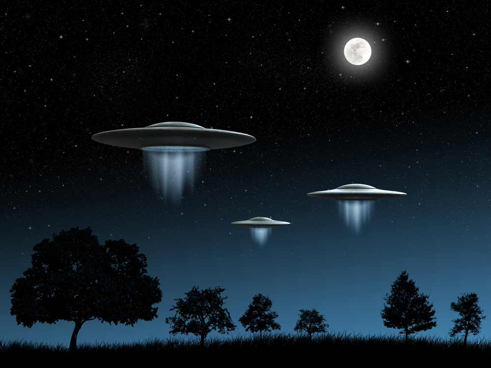

# Alien Assault

<p align="center">
    
</p>

<br/>
<br/>

## **✦ Game Preview** 🚀

---

<p align="center">
    
</p>

<br/>
<br/>

## **✦ About** ℹ️

---

Alien Assault is a classic 2D Canvas HTML game inspired by Space Invaders. The objective of the game is to eliminate all the alien spaceships before they reach the Earth and touch the player.

### **✦ Goal** 🎯

---

- Stay focused and eliminate all the alien spaceships before they descend to Earth and touch the player.
- Use the player's spaceship to shoot and destroy the aliens.
- Win the game by clearing all the aliens from the screen.

<br/>
<br/>

### **✦ Instructions** 🎮

---

Input map for player controls:

| Action         | Player   |
| -------------- | -------- |
| Move right     |  -->     |
| Move left      |  <--     |
| Shoot          | space    |

<br/>
<br/>

## **✦ Project Structure** 📂

---

```
├───📁 public/
│   └───📄 styles.css
    └───📄 background.png
    └───📄 bullet.png
    └───📄 enemy.png
    └───📄 player.png
    └───📄 explosion.wav
    └───📄 invaderkilled.wav
    └───📄 music.wav
    └───📄 shoot.wav
    └───📄 styles.css
├───📁 src/
│   ├───📁 actors/
│   │   ├───📄 bullets.ts
│   │   ├───📄 collision.ts
│   │   ├───📄 enemy.ts
│   │   ├───📄 fps.ts
│   │   ├───📄 player.ts
│   └───📄 main.ts
    └───📄 vite-env.d.ts
├───📄 .gitignore
├───📄 index.d.ts
├───📄 index.html
├───📄 package.json
├───📄 README.md
└───📄 tsconfig.json
```

<br/>
<br/>

## **✦ Acknowledgements** 🙏

 - [CoreCodeSchool](https://github.com/core-school)
 - [Juan Pablo Mora](https://github.com/Systrent)
 - [Marc Pomar](https://github.com/boyander)
 

<br/>
<br/>

## **✦ Autor** ✒️

This project was developed by:

* **Daniel Alvarado** - [danieldls-exe](https://github.com/DanielDls-exe)
---
⌨️ with ❤️ by [danieldls-exe](https://
